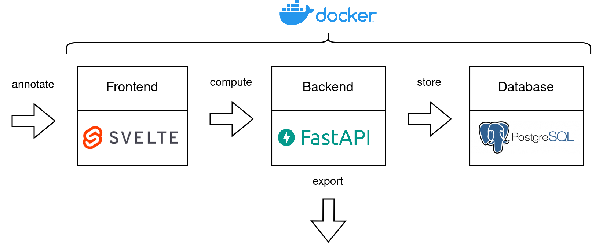

# PDFLAT
**PDF** **L**ayout **A**nnotation **T**ool

A simple, self-hosted, web-based app that allows you to annotate the layouts of PDF files to create custom datasets.

## Architecture

PDFLAT is powered by a [SvelteKit](https://kit.svelte.dev/) frontend, a [FastAPI](https://fastapi.tiangolo.com/) backend and a [PostgreSQL](https://www.postgresql.org/) database.
For an easy setup, consistency, and portability across different environments, the application is fully [dockerized](https://www.docker.com/).

## Setup

1. clone the repository
2. make sure your ports `1337`, `5173`, and `5432` are unoccupied (or modify the configuration if needed)
3. run `./start.sh` (might require admin rights => `sudo ./start.sh`, this will take quite a while, don't worry, it's normal)

## Usage

1. create your datasets at port [5173](HTTP://localhost:5173/)
2. upload PDF files for your datasets
3. annotate pages
4. use the API via port [1337](http://localhost:1337/docs) to export datasets for subsequent tasks

If you use PDFLAT in the process of creating any (published) work please cite this repository and feel invited to [drop me a message  ](jfreyberg.github.io) so I can see what you are working on :)

## Project Status

Please note that PDFLAT is in early beta status and lacks proper documentation and useful features.
Feel free to create pull requests if you improve it.
